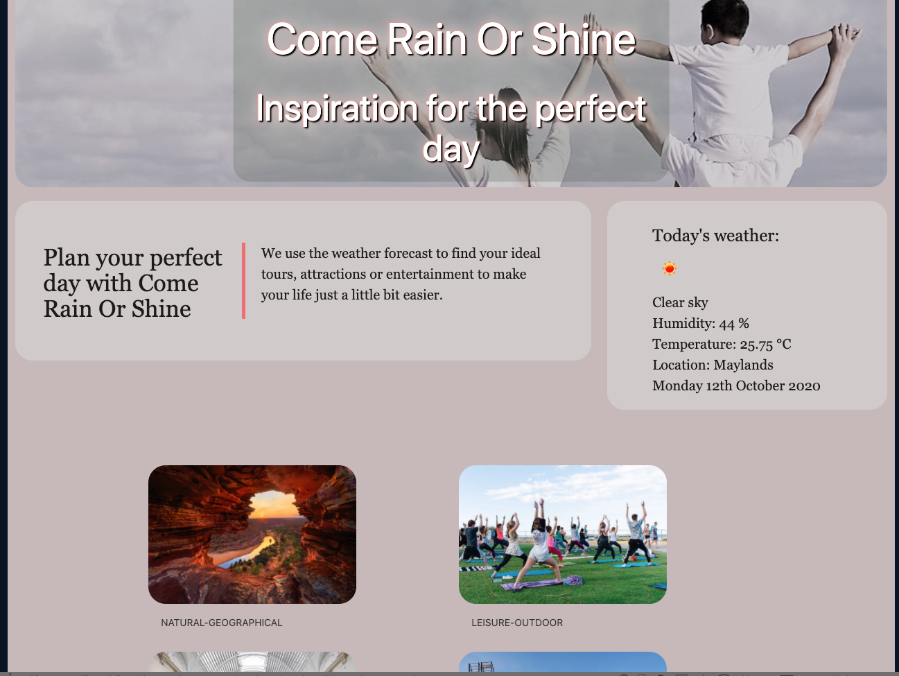

# Activity Planner
Application that generates the current weather and displays activities based on the User's location and category choice. 
 
 
## Table of contents
* [ User story](#User%20story)
* [Technologies](#Technologies)
* [Screenshot](#Screenshots)
* [Setup](#Setup)
* [App Link](#App%Link)
* [Improvement](#Improvement)

 

### User story

As a User I would like to plan a great day ahead without any effort. Before making any decision what to do I need to know what the weather forecast is so I can base my choice on it. I would like to choose from different categories and get a small amount of activities and places to visit that I can choose from.

 

### Technologies
<ul>
<li>Javascript
<li>CSS
<li>HTML
<li>JQuery
<li>Materialize CSS
<li>Openweather API
<li>Here Places API
</ul>

 

### Screenshots 

 

 

### Setup

When on landing page (see screenshot) the user will be asked to share his current location with the application. If the user declines, he will be asked again to allow to share his location, otherwise the application will not work.
After allowing the sharing of his location, the user is presented with current day's weather and the current date. Additionally the [...] and temperature are displayed.
  
The User can choose from five different Categories:

* Natural- Geographical
* Leisure - Outdoor
* Museum
* Landmark - Attraction
* Restaurant

Each of this categories gives the user a selection of 10 different activities within a 30km radius of his location.

 

### App Link
To view the App, please click on the link below:

[Come Rain Or Shine App](https://grahamelphick.github.io/holiday-weather-planner/)

### Improvement

* The User can choose a location with a free-text input
* The User can choose specific dates
* The results contain a link leading directly to the specific webpage 
* Fit App on one screen without scrolling needed
* The User can use a filter to narrow the search
* Results being only displayed when open